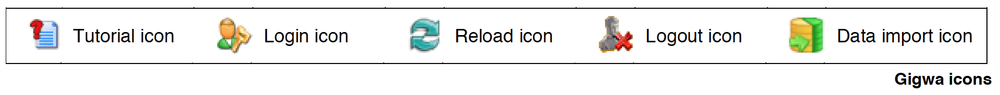

# gigwa

Gigwa aims at managing genomic and genotyping data from NGS analyses. It is a tool targeted at users with little computer expertise, providing means to explore visually large amounts of genotyping data by filtering it based not only on variant features including functional annotations, but also on genotypes themselves. It also offers several popular export formats and a density chart visualizer.

Try Gigwa online with public datasets at http://gigwa.southgreen.fr/

## v1.5 webapp is available! Check the wiki:
https://github.com/SouthGreenPlatform/gigwa/wiki

## Developer instructions

The source code is available in this repository in the structure of an Eclipse "dynamic web project". It uses Maven for dependency management and requires the following dependencies to be present in your workspace :

##### https://github.com/GuilhemSempere/mgdb
##### https://github.com/GuilhemSempere/mgdb_export

## Administration guide
### 1/ Prerequisites
Running Gigwa requires:

-	A web server with the following software installed:  JRE 7+, Apache Tomcat 7+
-	A database server (may or not be the same as the web-server) running MongoDB 3.0.6+

It is preferable to have a basic knowledge of the prerequisites (please refer to appropriate documentation regarding installation and usage issues). Otherwise, please note that a simplified installation may be performed (see section 2a).

A working knowledge of XML is also desirable if you wish to deploy Gigwa in multi-user mode.

### 2/ Deploying the application

#### a/ Installing the entire bundle (for beginners)
In order the simplify the setup process for users who would not feel confident to install the prerequisites, we provide for Windows and OSX a bundled version where a ready-to-run version of Gigwa is installed in Tomcat 8.0.32 alongside JRE 1.8.0u77 and MongoDB 3.2.4. Installation is as simple as deflating an archive into a location with enough disk space (1GB plus twice the size of the data files you are planning to import). Running the application is then achieved by launching a script, as explained in the README file located at the root of the deflated folder.

#### b/ Adding the webapp to Tomcat

This method is an alternative to the former and especially applies to cases where some of the prerequisites would already be present on the target system. Its main advantage lies in providing better flexibility via the possibility to split installation across several partitions or servers. It is therefore recommended for production use. The following procedure therefore assumes that JRE, Tomcat and MongoDB have been setup in such way that Tomcat is able to talk to the port on which MongoDB is running (true by default if on the same computer).

The Gigwa web-application is bundled into a zip file that may be deployed by following these few steps:
-	Unzip the gigwa directory contained in that file into any convenient location on the web server
-	Setup your instance by amending configuration files to let Gigwa know where to find data and how to give access to it (see next section Configuring access to your data)
-	Move the gigwa directory into Tomcat's webapps folder (unless unzipped there in the first place)
-	(Re)start Tomcat (or the Gigwa webapp using Tomcat manager)

After that, assuming Tomcat is configured to run on its default port on your local machine, your Gigwa instance will be accessible for you from http://localhost:8080/gigwa.

### 3/ Logging configuration

Gigwa uses Log4J as a logging API. Configuration is made via the file WEB-INF/classes/log4j.xml and by default writes to a file named gigwa.log in Tomcat's log folder. When the file size reaches 10Mb, it is automatically archived and a new one is created. You may refer to Log4J documentation if you need to modify this configuration. The webapp also has to be restarted for changes in this file to take effect.

### 4/ Configuring access to your data

This section divides in two subsections, one explaining how to connect Gigwa to MongoDB hosts and existing databases on those hosts, the other telling how to finely configure how and by whom those datasources may be accessed. It is important to note that any change applied to the below mentioned configuration files is only taken into account after application-context reload, which occurs either by restarting Tomcat, or reloading the Gigwa webapp from Tomcat manager, or (preferably) clicking the reload button provided to administrators.

#### a/ Defining datasources (or "modules")

This is done in two successive steps:

-	Declaring one or several hosts in WEB-INF/applicationContext-data.xml following provided examples. Only hosts running with authentication enabled (refer to MongoDB documentation if needed) must be declared along with a UserCredentials bean. Remember that Gigwa associates them internally using their IDs: a host named myMongoHost will expect a UserCredentials bean named myMongoHostCredentials. Those credentials must be provided for a user declared in MongoDB's admin collection, who has readWriteAnyDatabase and dbAdminAnyDatabase roles.

-	Defining actual datasources in WEB-INF/classes/datasources.properties by adding such lines:
my_module = myMongoHost,myModuleActualMongoDatabaseName
In this example, Gigwa will expose under the name my_module a datasource pointing to a database named myModuleActualMongoDatabaseName hosted on myMongoHost. Note that databases do not need to pre-exist for the datasource to be functional: you may start using Gigwa with an empty datasources.properties file, and use the import interface to feed it with VCF data.
However, since this file is the place where modules are defined, it is also used for configuring their privacy level (setting explicit user permissions is explained in the next sub-section 3b): 
  -	Preceding the module name by an asterisk (*) will make it public (accessible without login)
  -	Appending an asterisk to it will cause it to be hidden from the main datasource list
Therefore: 
  - *public_module defines a module that will be exposed in the list for everyone and for which the variant search view will be accessible even to anonymous users
  - hidden_module* defines a module that will be hidden from the list but for which the variant search view will remain accessible to authorized users
  - *public_and_hidden_module* defines a module that will be hidden from the list but for which the variant search view will be accessible even to anonymous users (via direct URL)

#### b/ Configuring multi-user mode

By default, Gigwa runs in a non-secure mode, in which anyone knowing its base URL can access all connected databases. This is good enough for some situations (installation on a local computer, or when all its data is public). It supports, however, a more advanced configuration, based on Spring-Security, which allows declaring lists of users and roles, thus defining who can access what.

Enabling multi-user mode is achieved by uncommenting the filter and filter-mapping tokens referring to springSecurityFilterChain at the bottom of WEB-INF/web.xml. Once this is done, open the file named WEB-INF/classes/users.properties which contains the list of users declared for your Gigwa instance:

Simple users may be added by following the example provided with the simpleUser1 token. Granting them permission to access datasources is achieved by specifying a comma-separated list of authorities, all starting with the same prefix ROLE_USER_, to which must be appended the corresponding datasource name. Note that datasources defined as public do not need any authority granted since they can be accessed even by anonymous users. All user definitions must end with ",enabled" unless... you guess what!

A default administrator is defined with the username gigwadmin. You may define other administrators by also granting them the ROLE_ADMIN authority. Administrators have the following particular capabilities:
-	Viewing all connected databases whatsoever.
-	Importing new data via a dedicated interface linked from an icon at the top. Once the upload has completed, the datasource is made private and no simple user has permissions to use it yet.
-	Reloading the application context, also via an extra icon at the top. This step is necessary for the application to take into account any modification applied to the mentioned configuration files. Typically, after importing a new module, the administrator may want to amend datasources.properties and/or applicationContext-security.xml to adjust permissions on it, and will click on that icon so that new permissions are immediately applied.

As for the non-secure mode, it can be briefly described by the fact that it provides no login/logout functionality, and that it therefore treats any user as an administrator.

